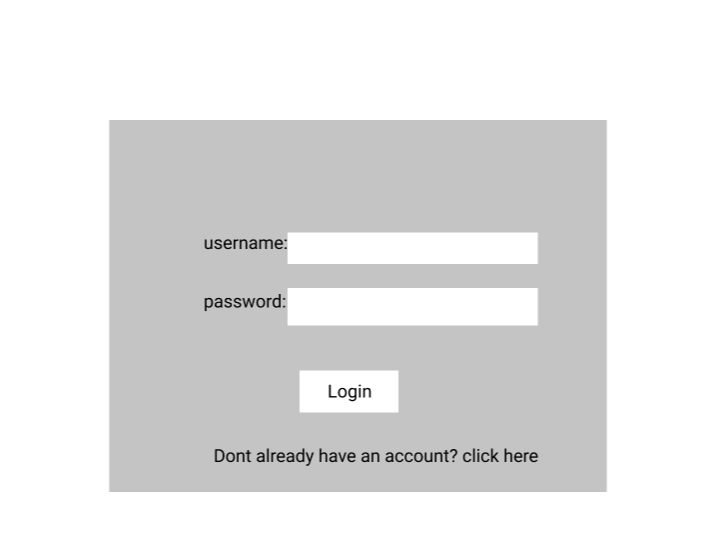
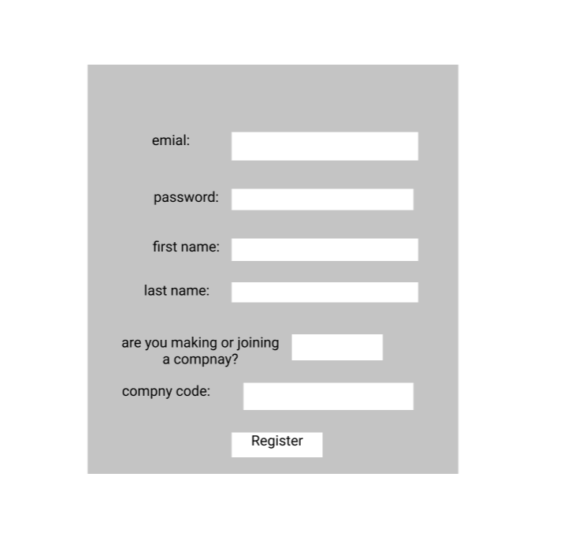
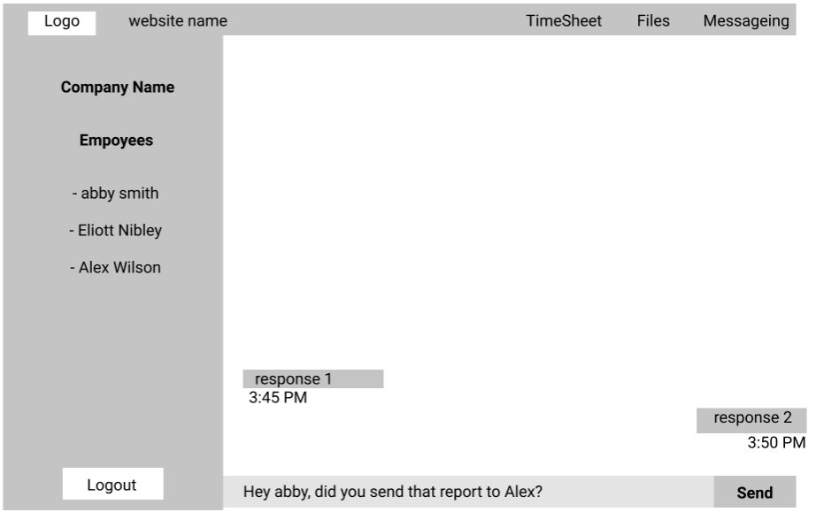
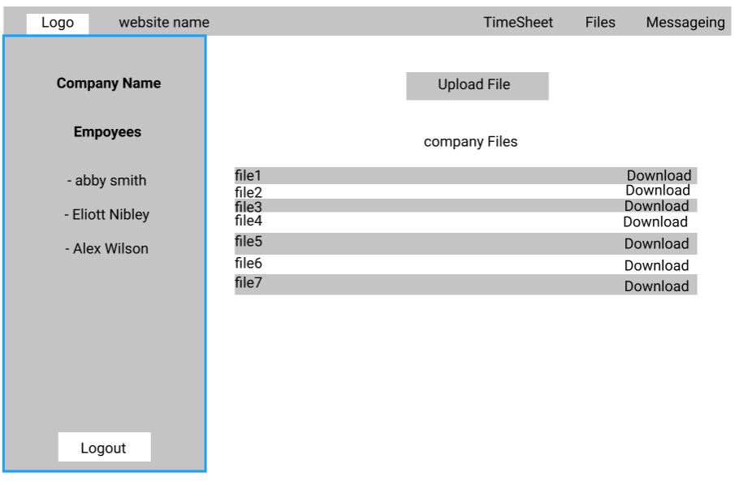
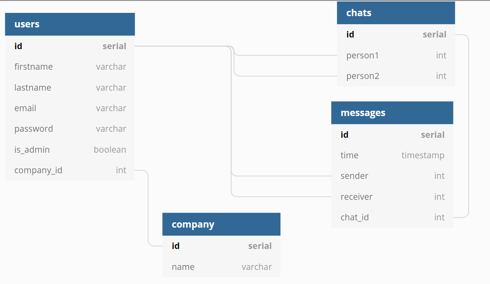

# Quarantine Officespace

## Idea and Users
- A website for employers to keep track of employees work hours and productivity while they work from home
- this is accomplished by using instant messaging and login tracking to help connect employees working from home

## MVP 
- Login and register functionality as employee or admin
- admin can create a company
- Employee and Admin can clock in and clock out
- Dashboard will display who is clocked in or out
- Admin can send an invitation using (NodeMailer) to an employee with a code to join the admin company
- Instant message anyone in the company (socket.io)
- control view based on authentication

**Icebox**
- At clock out employee is promped to report on what they accomplished
- Admin can view when each employee clocked in or out and also view the progress report connected to logout
- Employee can view their total hours worked
- Admin can view total hours worked of all employees
- users can create chat rooms 
- files can be attached to instant messeging
- ability to create subgroups within a company and message in those groups
- audio call and video call
- make a file storage that can be accessed based on authentication 
- create a projects tab where an admin can create a project. all users can view and update the project status
- project with include a checklist of items to accomplish
- project status will update according to the checklist
- projects tab will also have a task list for small

## Wireframe
### Authentication
**Login**

**Register**

**Dashboard**

**Files Page**

## Routes
- dynamic messaging route for each employee
- timesheet route
- dynamic timesheet route if user is admin

**icebox**
- files page route
- a To Do route 

## Database

## Endpoints
- post('/api/auth/register', auth.register)
- post('/api/auth/login', auth.login)
- put('/api/auth/edit', auth.editUser)
- delete('/api/auth/logout', auth.logout)
- post('/api/message', mess.post)
- get('/api/message/:chatId', mess.get)

### Controllers
**Authentication**
- register (req, res) {
  req.body = {
    firstname, lastname, email, password, isAdmin, company_id
  }

  - return (
    id, firstname, lastname, isAdmin, Company_id
  )
  }

- login (req, res) {
    req.body = {
      email, password
    }
    - return (
    id, firstname, lastname, isAdmin, Company_id
  )
  }

- editUser (req, res) {
  req.body = {
    firstname, lastname, email, password, isAdmin, company_id
  }

  - return (
    id, firstname, lastname, isAdmin, Company_id
  )
  }

- logout (req, res) {

  }

**Messages**
- post {
    req.body = {
      sender, receiver, chat_id
    }
  }

- get {
    req.params= {chat_id}

    - return ( 
      messages{id, time, sender, receiver, chat_id}
    )
  }

## Point Plan
- 40 points from core
  - make 3+ responsive views (10pts)
  - Redux to hold user session (10pts)
  - use Hooks (10pts)
  - authentication (10pts)
- 30 points from technologies
  - most ov the app design is for instant user communicaiton (20pts)
  - nodemailer to invite users to groups (10pts)
- 15 points from hosting

**Total of 85 points**